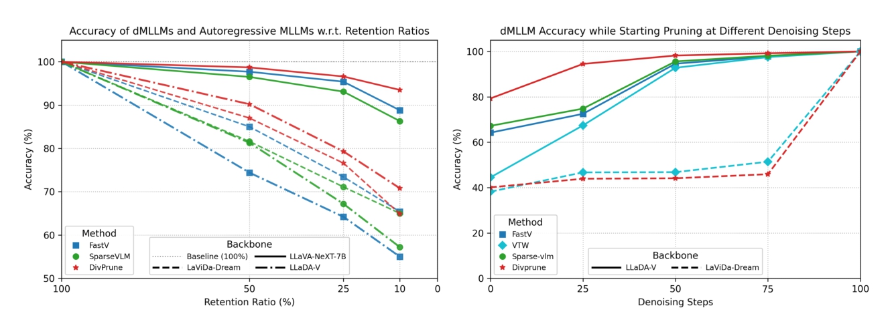

<div align="center">

<h1>🔍 A Comprehensive Study on Visual Token Redundancy for<br>Discrete Diffusion-based Multimodal Large Language Models</h1>

<p>
  <strong>Duo Li<sup>*</sup></strong>&nbsp;&nbsp;
  <strong>Zuhao Yang<sup>*</sup></strong>&nbsp;&nbsp;
  <strong>Xiaoqin Zhang</strong>&nbsp;&nbsp;
  <strong>Ling Shao</strong>&nbsp;&nbsp;
  <strong>Shijian Lu<sup>†</sup></strong>
</p>

<p>
  <sup>*</sup>Equal contribution &nbsp;&nbsp; <sup>†</sup>Corresponding author
</p>

<p>
  <a href="https://arxiv.org/abs/2511.15098">
    
  </a>
  <a href="https://github.com/Yrdal3910/dMLLM-Visual-Token-Redundancy-Analysis">
    
  </a>
</p>

</div>

---

## ✨ Highlights

- 🎉 Our paper has been accepted to **CVPR 2026 Findings**.

## 🧭 Navigation

[Overview](#overview) ·
[Environment](#environment) ·
[Methods](#methods) ·
[Evaluation](#evaluation) ·
[Compression Code](#compression-code) ·
[Citation](#citation) ·
[License](#license)

<a id="overview"></a>
## 🔭 Overview

We conduct a systematic study of **whether visual token redundancy exists in
prevalent dMLLMs**, **how visual token pruning affects inference accuracy and
efficiency**, and **how these observations can guide effective pruning
strategies**. Our analysis covers both from-scratch and AR-to-diffusion dMLLMs
across different architectures, tasks, retention ratios, and pruning schedules.

<p align="center">
  
</p>

<a id="environment"></a>
## 🛠️ Environment Setup

The environments for both models are identical to those used by their official
repositories. Please follow the corresponding installation instructions:

- [jacklishufan/LaViDa](https://github.com/jacklishufan/LaViDa)
- [ML-GSAI/LLaDA-V](https://github.com/ML-GSAI/LLaDA-V)

Follow the official README files to install the dependencies, download the
model checkpoints, and configure Hugging Face access. No additional
project-specific dependencies are required.

<a id="methods"></a>
## 🧩 Compression Methods

The `eval` directories of both LaViDa and LLaDA-V contain implementations of
the following six visual token compression methods:

| Method | Implementation directory | Category |
| :--- | :--- | :--- |
| **DivPrune** | `llava_divprune` | Diversity-aware pruning |
| **FastV** | `llava_fastv` | Attention-based pruning |
| **SparseVLM** | `llava_sparsevlm` | Text-guided pruning |
| **ToMe** | `llava_tome` | Token merging |
| **TRIM** | `llava_trim` | Text-relevant token reduction |
| **VTW** | `llava_vtw` | Visual token weighting |

The evaluation framework imports the implementation from a directory named
`llava`. Before evaluating a compression method, temporarily rename its
`llava_<method>` directory to `llava`.

> [!IMPORTANT]
> Only one implementation can be active at a time. Back up or rename the
> existing `llava` directory before switching methods. Do not overwrite it.

For example, to evaluate DivPrune with LaViDa:

```bash
cd LaViDa/eval
mv llava llava_base
mv llava_divprune llava

bash run_dream.sh

# Restore the directory names after evaluation.
mv llava llava_divprune
mv llava_base llava
```

The procedure is the same for LLaDA-V:

```bash
cd LLaDA-V/eval
mv llava llava_base
mv llava_divprune llava

bash scripts/evaluate.sh

# Restore the directory names after evaluation.
mv llava llava_divprune
mv llava_base llava
```

Replace `llava_divprune` with the directory name of any other method to
evaluate that implementation.

<a id="evaluation"></a>
## 🚀 Evaluation

### 🌙 LaViDa

The LaViDa evaluation entry point is:

```text
LaViDa/eval/run_dream.sh
```

After selecting a compression implementation, run:

```bash
cd LaViDa/eval
bash run_dream.sh
```

The tasks, GPUs, process count, and output directory can be configured through
environment variables:

```bash
CUDA_VISIBLE_DEVICES=0,1 \
NUM_PROCESSES=2 \
TASK_NAMES=mme,chartqa \
OUTPUT_PATH=exp/lavida_eval \
bash run_dream.sh
```

The default model is `jacklishufan/lavida-dream-v1.0-instruct`, and the
default task is `mme`.

### 🌌 LLaDA-V

The LLaDA-V evaluation entry point is:

```text
LLaDA-V/eval/scripts/evaluate.sh
```

After selecting a compression implementation, run:

```bash
cd LLaDA-V/eval
bash scripts/evaluate.sh
```

The tasks, GPUs, and output directory can be configured through environment
variables:

```bash
CUDA_VISIBLE_DEVICES=0,1,2,3,4,5,6,7 \
TASK_NAMES=mme,chartqa \
OUTPUT_PATH=exp/llada_v_eval \
bash scripts/evaluate.sh
```

The default model is `GSAI-ML/LLaDA-V`, and the default task is `mme`.

The current script sets `accelerate --num_processes` to `8`. To use a
different number of GPUs, update this argument in the script accordingly.

<a id="compression-code"></a>
## 🧠 Compression Code

The following paths use `llava_divprune` as an example. Implementations of
the other methods are located in their corresponding `llava_<method>`
directories.

### 🌙 LaViDa

The main modifications are located in:

```text
LaViDa/eval/llava_divprune/model/llava_arch.py
LaViDa/eval/llava_divprune/model/language_model/dream/generation_utils.py
LaViDa/eval/llava_divprune/model/language_model/dream/modeling_dream.py
```

To enable compression, set the following flag to `True`:

```python
START_COMPRESSION_MODE = True
```

The flag is currently defined in:

```text
LaViDa/eval/llava_divprune/model/llava_arch.py
LaViDa/eval/llava_divprune/model/language_model/dream/generation_utils.py
```

### 🌌 LLaDA-V

The main modifications are located in:

```text
LLaDA-V/eval/llava_divprune/model/llava_arch.py
LLaDA-V/eval/llava_divprune/model/language_model/modeling_llada.py
```

To enable compression, set the flag in both files to:

```python
START_COMPRESSION_MODE = True
```

To evaluate the uncompressed baseline, set the relevant flags to `False` or
use the original `llava` implementation.

## 🙏 Acknowledgements

This project is built upon the excellent open-source implementations of
[LaViDa](https://github.com/jacklishufan/LaViDa),
[LLaDA-V](https://github.com/ML-GSAI/LLaDA-V), and
[lmms-eval](https://github.com/EvolvingLMMs-Lab/lmms-eval). We also thank the
authors of the six visual token compression methods evaluated in this study.

<a id="citation"></a>
## 📝 Citation

If you find this project helpful, please consider citing our paper:

```bibtex
@InProceedings{Li_2026_CVPR,
    author    = {Li, Duo and Yang, Zuhao and Zhang, Xiaoqin and Shao, Ling and Lu, Shijian},
    title     = {A Comprehensive Study on Visual Token Redundancy for Discrete Diffusion-based Multimodal Large Language Models},
    booktitle = {Proceedings of the IEEE/CVF Conference on Computer Vision and Pattern Recognition (CVPR) Findings},
    month     = {June},
    year      = {2026},
    pages     = {2823--2833}
}
```

<a id="license"></a>
## 📜 License

This project uses the repository-level [LICENSE](LICENSE). Code derived from
LaViDa, LLaDA-V, and the compression methods remains subject to the respective
original licenses.
